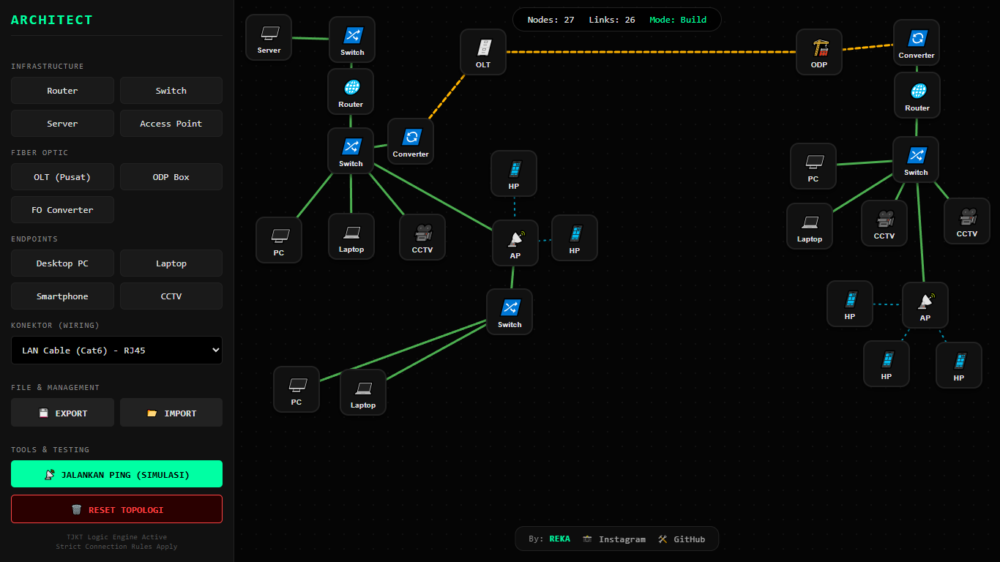

# 🌐 THE ARCHITECT | Ultimate Network Simulator

> [!CAUTION]
> **DESKTOP REQUIRED**
> Simulator ini menggunakan sistem *Drag & Drop* dan *Hover* yang presisi. Perangkat **Mobile (HP/Tablet)** tidak didukung. Gunakan **PC atau Laptop** dengan Mouse/Trackpad untuk pengalaman terbaik.

**THE ARCHITECT** adalah simulator jaringan berbasis web yang dirancang untuk memvisualisasikan cara kerja topologi jaringan secara interaktif.

## ✨ Fitur Utama
- **Build Mode:** Drag & drop Router, Switch, OLT, Server, dan Endpoints.
- **Wiring System:** Aturan koneksi otomatis (LAN, FO, WiFi) sesuai standar TJKT.
- **Ping Simulation:** Visualisasi ICMP Echo dengan pesan gaya CMD yang autentik.
- **Save/Load:** Ekspor dan impor topologi dalam format JSON.

## 🛠️ Teknologi
- HTML5, CSS3, & Vanilla JavaScript.
- SVG untuk pergerakan kabel dinamis.

## 📜 Lisensi
Proyek ini dilisensikan di bawah **MIT License**.

---
Developed by **REKA**
